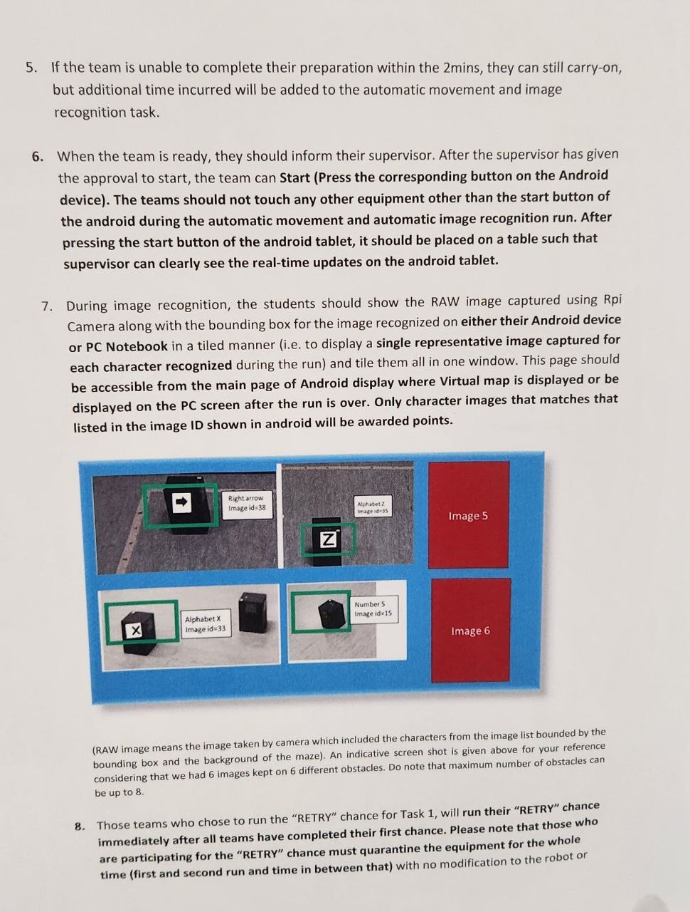
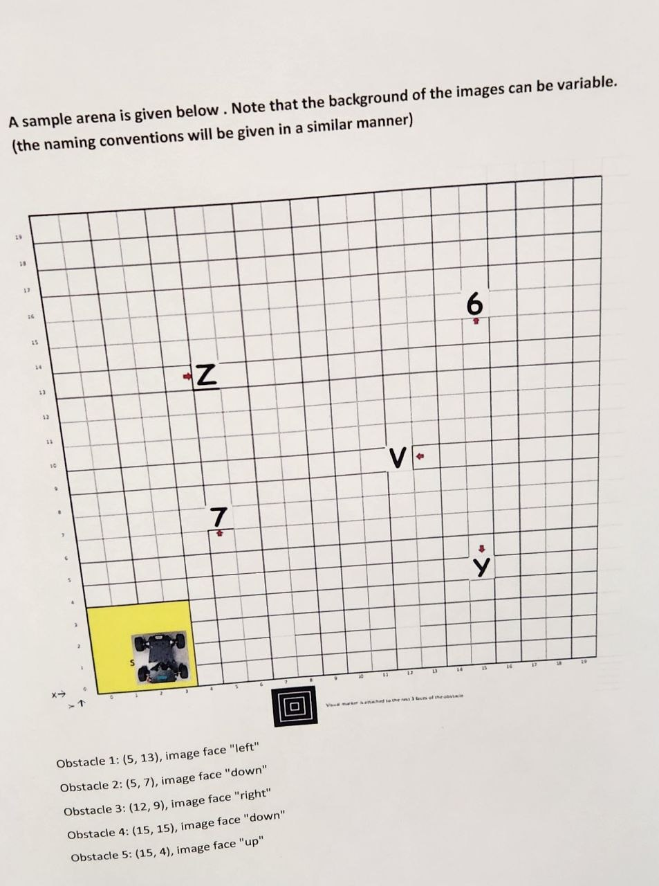

# Official MDP assessment rules — transcription

Transcribed from 8 photos taken in the lab, `docs/rules/1.jpg` – `docs/rules/8.jpg`. The photos are
slightly angled; if a number here looks wrong, check it against the photo it's cited from. This
transcription is the authority the two `-v2` design docs (`docs/superpowers/specs/`) and plans
(`docs/superpowers/plans/`) are checked against.

---

## MDP Assessment Rules (`docs/rules/1.jpg`)

1. The arena is an **open arena — no boundary boards**.
2. All teams must place their equipment (laptop, tablet, robot) in the **quarantine area** before
   the arena layout is released.
3. Team running order is random.
4. Once notified, a team has **2 minutes of preparation time** from the quarantine area.
5. Apart from a first attempt, **one "RETRY" chance is given for Task 1 and Task 2 combined** — not
   one each. Taking a retry voids the first run's score entirely; the score is the retry's alone.
   The equipment must stay quarantined for the whole time — both runs and the time in between —
   with **no modification to the robot or algorithm settings**.

## Task 1 — automatic movement and image recognition (`docs/rules/1.jpg` – `docs/rules/4.jpg`)

1. Obstacle position and images must match the official layout the supervisors give — checked
   against the **(x, y) coordinates only**, no physical measurement needed.
2. Running with the wrong image, facing or position gets **no second chance** — scored against the
   official layout regardless.
3. During the 2-minute prep, the team is given the obstacles' (x, y) and each one's image face, and
   keys this into the Android tablet **in front of a supervisor**.
4. To qualify, the robot must identify each obstacle's image ID, update the ID on the Android tablet
   **in real time**, and **stop automatically by itself within 6 minutes**.
5. Running over the 2-minute prep is allowed, but the overrun is deducted from the 6-minute budget.
6. After supervisor approval, press Start on the tablet. **Touch nothing else** but the Start button
   during the run. Once pressed, the tablet must be placed down where the supervisor can see the
   live updates.
7. The team must show the **RAW image captured by the Pi camera with its bounding box**, on either
   the Android tablet or the PC, **one representative image per recognised character, tiled into one
   window** — reachable from the same screen as the virtual map, or shown on the PC after the run.
   Only images matching the image ID shown on the tablet score. (Max obstacles: **8**.)

   
8. A "RETRY" run happens immediately after all teams finish their first attempt. Equipment stays
   quarantined the whole time.
9. Supervisors watch the image ID update live. The map with updated image IDs must be shown at the
   end. **Not showing the image ID makes the result invalid.**
10. Task 1 timing **ends when all recognised image IDs are shown on the tablet**. The robot **must
    stop by itself** within the 6-minute cap to qualify — this includes being stopped manually,
    which also makes the run "incomplete" (see FAQ 15).
11. The team must ensure the supervisor photographs the virtual map with image IDs shown, and must
    e-mail the supervisor a screenshot of the map with IDs plus the screen of all RAW captures.

### Image ID table (`docs/rules/3.jpg`)

IDs 11–19 are digits 1–9, 20–35 are letters A–Z (skipping I–R), 36–40 are up/down/right/left arrows
and a stop marker — the same table as `AGENTS.md` §3.4. **4 to 8 obstacles**, drawn from a pool of
**30 images**. Backgrounds can vary.

### Sample arena

*Confirms the naming convention `AGENTS.md` already assumes; no new information for `rpi/`.*

## Task 2 — fastest car (`docs/rules/6.jpg`)

*Obstacle 2's dimension (10cm wide, 30cm+ long) is only revealed just before the competition, after
the preparation time — the exact number is printed on the figure above, not fixed in advance.*

1. During the 2-minute prep, the team may check Bluetooth/Wi-Fi and calibrate, but **the robot must
   stay inside the carpark zone** the whole time.
2. Obstacles and images are set up only **after** prep ends, so the team cannot measure the
   carpark-to-obstacle distance or feed it into their system in advance.
3. To qualify, the robot must run automatically from the carpark, reach each goal obstacle,
   recognise its arrow, act on it, and return to the **same** carpark, stopping by itself inside it,
   within **3 minutes**. A right arrow → go round the obstacle's right side; a left arrow → its left
   side. Same image height as Task 1; **arrow background is white only**.
4. Same start procedure as Task 1: supervisor approval, press Start, touch nothing else.
5. Prep overrun is deducted from the 3-minute Task 2 budget, same rule as Task 1.
6. Task 2 timing **stops once the robot fully enters the carpark zone and stops**. **Hitting the
   carpark wall is an outright disqualification** — distinct from hitting a goal obstacle, which is
   only a time penalty (item 9 below).
7. A team may use its one shared RETRY for Task 2 if it wasn't used on Task 1. The retry replaces
   the whole run's score and follows immediately after the main run.
8. Same RAW-image-with-bounding-box requirement as Task 1, but scoped to **images on goal obstacles
   recognised during the run**, tiled in one window, reachable from the map screen or shown on PC.
9. **Each hit of an obstacle** adds a time penalty (see FAQ 5–7 below).
10. At the end, the supervisor photographs the screen of all RAW images captured; the team e-mails a
    copy afterward.

## FAQ (`docs/rules/7.jpg`, `docs/rules/8.jpg`)

1. The robot has "reached the carpark" only once the **entire robot** is inside it.
2. Exiting the carpark without going around the goal obstacle and returning does **not** qualify for
   Task 2.
3. Task 1 (12.5%) scores **+10 points per correct image ID on the correct obstacle** in the virtual
   map.
4. A **wrong** image ID is a **−10 point penalty**.
5. Each new/distinct obstacle hit in Task 2 adds a **+10 second** penalty to the timing.
6. Hitting the **carpark wall** during Task 2 is a **disqualification**, not a time penalty.
7. A "distinct hit" is any **new move** made while still in contact — e.g. touching an obstacle and
   stopping is one 10s penalty; continuing to turn while still touching it adds another 10s **per
   turn**, for as long as contact is maintained. **Bulldozing an obstacle is not permitted.**
8. Going over the 2-minute prep is allowed; the overrun eats into the task's own time budget (e.g. 3
   minutes prep leaves 5 minutes for Task 1's image recognition).
9. Moving the robot **beyond the carpark zone during the prep-time calibration** is an automatic
   disqualification.
10. A wrong image detected, or a wrong turn relative to the given Task 2 image, is an automatic
    disqualification for that run.
11. Bulldozing through obstacles in Task 2 is strictly not allowed; any team that attempts it is
    disqualified.
12. Showing the virtual map with image IDs on the laptop but **not** the tablet does **not** qualify
    for Task 1 image recognition.
13. Same as #12: real-time virtual-map updates shown only on the laptop, not the Android device, do
    **not** qualify.
14. Teams tied on image recognition score are ranked by **recognition timing**.
15. If the robot fails to stop by itself during Task 1, the team may stop it manually — but the run
    is then marked **"incomplete"** and ranks below every team that stopped automatically (with no
    physical intervention), regardless of score.
16. Not being able to show the RAW images (Android or PC) at the end of Task 1 **or** Task 2 means
    the team does not qualify for that task, even if everything else succeeded.
17. The shared RETRY chance can be used **once only** — for either task, not both.
18. Disagreements with lab supervisors go to the MDP coordinators, backed by evidence (e.g. video).
    **The coordinators' decision is final.**

---

## What this means for `rpi/` — summary

See the "Rule deltas" section at the top of each `-v2` doc under `docs/superpowers/{plans,specs}/`
for the detail. In short:

- **Task 1** needs a confidence floor before reporting an image ID (a wrong guess costs −10, a miss
  costs 0), and a hard 6-minute run deadline that stops the robot by itself.
- **Task 2** needs obstacle 2's width/length treated as a late-bound runtime value, not a firmware
  constant "measured on the day" — its dimension isn't known until after prep, right before the run.
  Hitting the carpark wall needs to be treated as far worse than hitting an obstacle. Arrow-read
  frames need to reach the PC server for the same RAW-image-with-bounding-box requirement Task 1 has.
